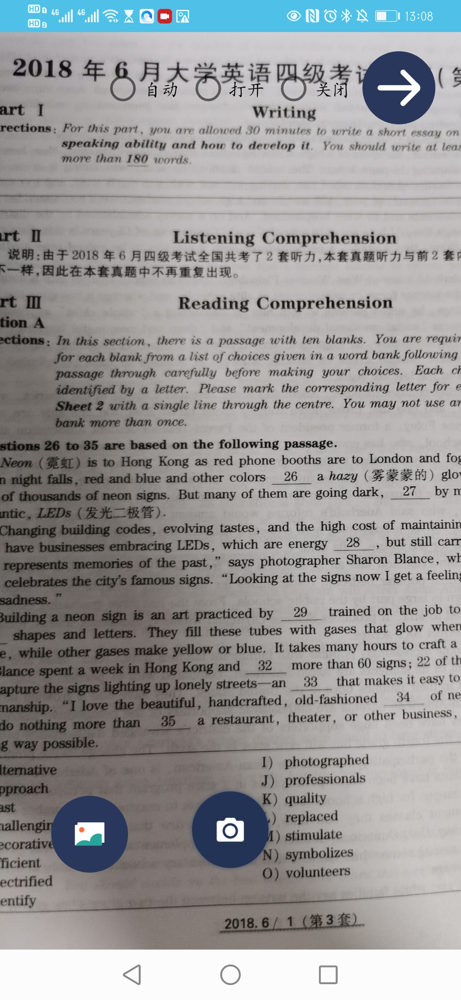
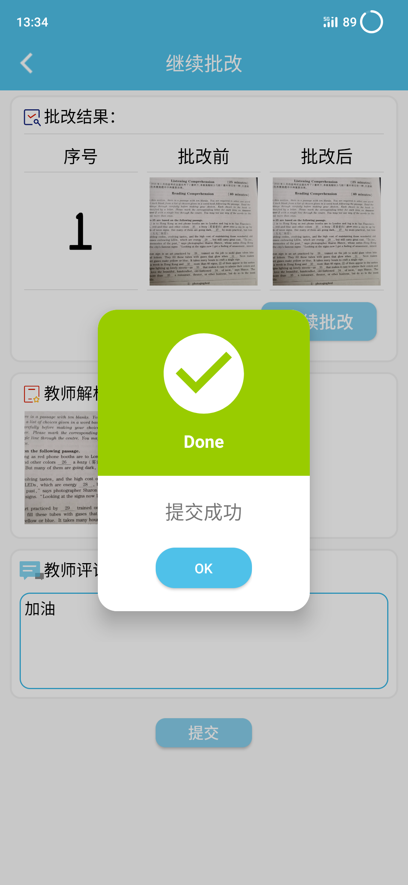

# 2018级项目实训成果展示 

## 《作业批》 -  Java与移动智能设备开发方向

###  项目简介

> 作业批——让学生作业批改问题不再令家长头疼

无数家长抱怨，一个小学生的作业就把全家搞得鸡犬不宁．几乎每天下班后，家长都要面临孩子的作业问题，不只要辅导孩子完成作业，还要进行批改．于是无数家长说，作业不是老师批改的吗，怎么现在变成了家长的事？完全靠学校老师是不行的，家长也必须做一定的工作才能促使孩子进步．学校老师每天讲解知识及题型，回家学生要完成作业和订正的任务．而并不是每个学生都能自觉地去完成，即使是主动去完成，完全的效率也是完全不一样的．孩子本身就有惰性，家长此时需要发挥督促的作用，甚至在一些细节方面需要家长指导．但是与之俱来的是家长没能力，老师有时没时间的问题。为了解决这一矛盾，作业批诞生了。

### 项目地址

- Github：
- 家长端：https://github.com/LiHongchao1999/bigwork-android
- gitee：
- 项目汇总仓库：https://gitee.com/lihongchao1999/zuo-ye-pi
- 服务器端：https://gitee.com/lihongchao1999/bigwork-server
- 教师端：https://gitee.com/lihongchao1999/bigwork-android-teacher

### 项目成员

- 张子华（项目经理）
  - Email：1324088931@qq.com
  - Github：https://github.com/ZihuaZhang
- 薛程元（开发工程师）
  - Email：871356438@qq.com
  - Github：https://github.com/xuechengyuan
- 丁萌阳（UI设计师）
  - Email：1826466183@qq.com
  - Github：https://github.com/irvingding
- 张嘉豪（测试工程师）
  - Email：731526545@qq.com
  - Github：https://github.com/zhanggahao
- 李宏超（后端开发工程师）
  - Email：1437518093@qq.com
  - Github：https://github.com/LiHongchao1999
- 龚秋锦（开发工程师）
  - Email：2811018487@qq.com
  - Github：https://github.com/QJhappy
- 马奕扬（开发工程师）
  - Email：1007330548@qq.com
  - Github：https://github.com/myylujiu
- 高嘉欣（开发工程师）
  - Email：1831339473@qq.com
  - Github：https://github.com/sunshinejiaxin
- 李晴（开发工程师）
  - Email：943046052@qq.com
  - Github：https://github.com/liqing

### 项目截图

  
  
  

  
  
  

  
  
  

  
  
  

  
  
  

  
  

